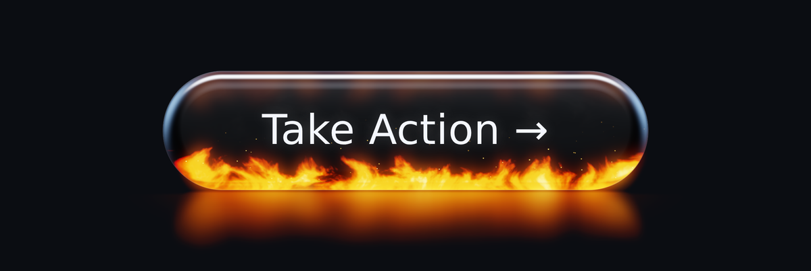
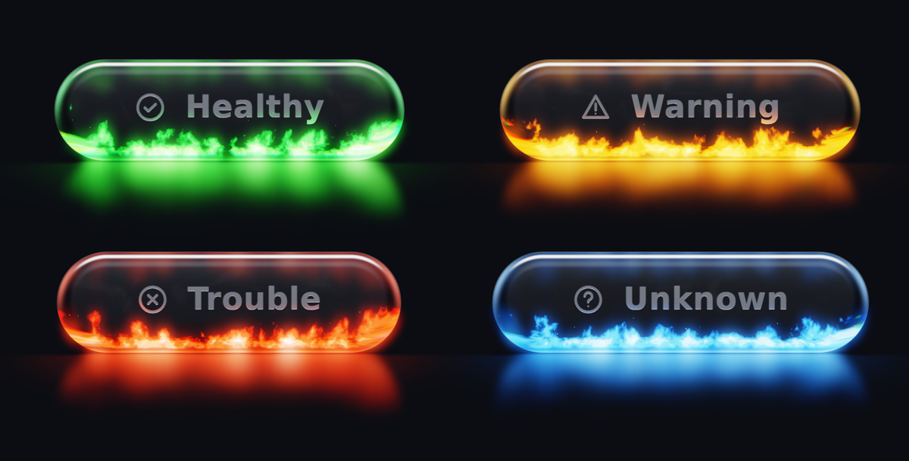
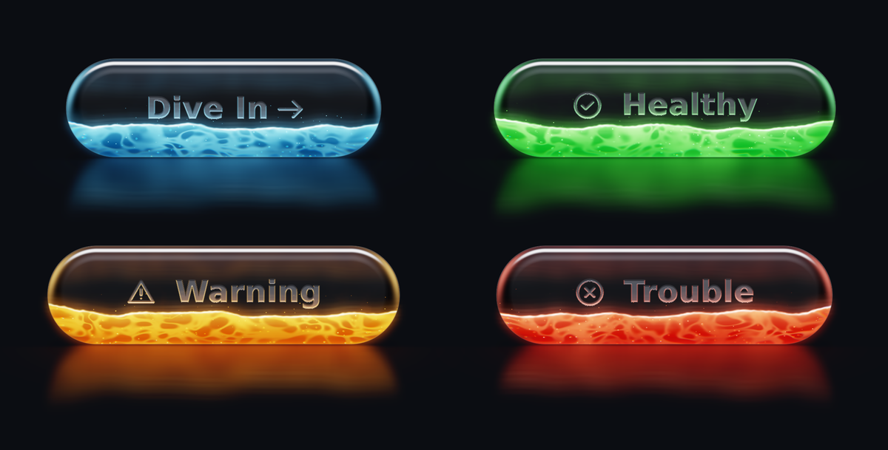

# glass-button

A framework-agnostic `<glass-button>` custom element: a thick, dark,
translucent glass pill with a procedural effect living inside its lower
third, fire or water, rendered in real time with WebGL2. The effect lights
the glass (coloured lower rim, light bleeding into the body, refraction
through the curved edges), throws a soft reflection on the floor beneath, and
responds to hover, pointer position and press. Four status modes recolour it
and add an icon. Underneath it is a plain `<button>` with slotted HTML text, so it
stays sharp, focusable and accessible.

Zero runtime dependencies. Ships as ESM and as a plain `<script>` IIFE.

**[Live demo](https://vic10us.github.io/glass-button/)** — hover, press, switch
effect and status, tune every parameter, try it on different backgrounds.

[](https://vic10us.github.io/glass-button/)

[](https://vic10us.github.io/glass-button/)

[](https://vic10us.github.io/glass-button/)

## Install

```bash
npm install @vic10us/glass-button
```

## Usage

### Vanilla HTML/JS

```html
<script type="module" src="node_modules/@vic10us/glass-button/dist/glass-button.js"></script>

<glass-button>Take Action →</glass-button>

<script type="module">
  const el = document.querySelector('glass-button');
  el.addEventListener('click', () => console.log('clicked'));
  el.level = 1.2;                 // property, reflected to level="1.2"
  el.params = { bloom: 0.8 };  // merge several parameters at once
</script>
```

Or via the global build (also on a CDN: `https://cdn.jsdelivr.net/npm/@vic10us/glass-button/dist/glass-button.global.js`):

```html
<script src="node_modules/@vic10us/glass-button/dist/glass-button.global.js"></script>
<glass-button>Take Action →</glass-button>
```

Size it with `font-size` (padding is in `em`), or give the host an explicit
`width`/`height`; the inner button fills the host. The canvas that draws the
glow extends beyond the pill, like a drop shadow, so leave room below it.

### React

React 19 binds attributes, properties and custom events on custom elements
directly:

```jsx
import '@vic10us/glass-button';

export function Health({ status, onChange }) {
  return (
    <glass-button status={status} effect="water" onStatuschange={(e) => onChange(e.detail.newStatus)}>
      Server A
    </glass-button>
  );
}
```

React 18 and earlier pass attributes as strings, which covers every parameter,
`status`, `effect`, `icon` and `disabled`. Only the `statuschange` event needs
a ref:

```jsx
import { useEffect, useRef } from 'react';
import '@vic10us/glass-button';

export function Health({ status, onChange }) {
  const ref = useRef(null);
  useEffect(() => {
    const el = ref.current;
    const handler = (e) => onChange(e.detail.newStatus);
    el.addEventListener('statuschange', handler);
    return () => el.removeEventListener('statuschange', handler);
  }, [onChange]);
  return <glass-button ref={ref} status={status}>Server A</glass-button>;
}
```

### Vue 3

Tell the compiler the tag is a custom element so it is not treated as a
missing component, then bind as usual:

```js
// vite.config.js
export default {
  plugins: [vue({ template: { compilerOptions: { isCustomElement: (tag) => tag === 'glass-button' } } })],
};
```

```vue
<script setup>
import '@vic10us/glass-button';
defineProps({ status: String });
</script>

<template>
  <glass-button :status="status" effect="fire" @statuschange="$emit('change', $event.detail)">
    Server A
  </glass-button>
</template>
```

### Angular

Add `CUSTOM_ELEMENTS_SCHEMA` to the module or standalone component:

```ts
import { Component, CUSTOM_ELEMENTS_SCHEMA } from '@angular/core';
import '@vic10us/glass-button';

@Component({
  selector: 'app-health',
  standalone: true,
  schemas: [CUSTOM_ELEMENTS_SCHEMA],
  template: `<glass-button [attr.status]="status" (statuschange)="onChange($event)">Server A</glass-button>`,
})
export class HealthComponent { status = 'healthy'; onChange(e: Event) { /* (e as CustomEvent).detail */ } }
```

### Svelte

```svelte
<script>
  import '@vic10us/glass-button';
  export let status = 'healthy';
</script>

<glass-button {status} on:statuschange={(e) => (status = e.detail.newStatus)}>Server A</glass-button>
```

### Server-side rendering

The module is safe to import on the server: nothing touches the DOM until an
element is constructed, and registration is skipped when `customElements` is
absent. Import it from code that also runs in the browser (a Next.js
`'use client'` component, a Nuxt component, a SvelteKit page) so the client
bundle registers the tag and upgrades the server-rendered markup in place.
The server output is the plain tag with its light-DOM text, so the label is
in the HTML before hydration. `defineGlassButton(tag)` is exported if you
need to register under a different tag name.

## Engraved label

The label is not printed on the glass, it is engraved into it. The element
rasterises its own text and built-in icon into a coverage mask at device
resolution (tracing the live DOM layout, so wrapping, fonts and spacing stay
the browser's job) and the composite shader treats the mask as a shallow
groove in the front face: a frosted floor that scatters whatever light
reaches it (the page behind, the studio above, the effect below), an upper
wall in shadow, a lower wall that catches the key light and a faint warm line
from the fire, and bevel glints from the same environment the glass reflects.
There is no text colour and no text shadow; the letters read because rough
glass scatters light differently from polished glass, on any page.

A trailing `→` in the label is replaced by a drawn arrow proportioned to the
font. The DOM text stays in the tree (transparent) for assistive technology,
find-in-page and selection. A consumer-provided `slot="icon"` element is not
engraved and stays visible. Without WebGL2 the plain text shows.

`etch` property (development tuning, merges keys): `{ mode, depth,
roughness, bevel, interaction }`. `mode` 1 recesses the letters into the
surface (default), 2 places them just beneath it, 0 shows plain text.

## Status modes

`status="healthy" | "warning" | "trouble" | "unknown"` recolours the fire,
the glass rim and the floor glow, shows a matching line icon (check circle,
warning triangle, cross circle, question circle) and applies a few preset
parameter nudges (Unknown burns lower and sparklier, like plasma). Without
a status the button keeps the default orange fire and shows no icon.
Changing the status crossfades the palette over about half a second.

```html
<glass-button status="healthy">Healthy</glass-button>
<glass-button status="trouble" icon="none">Trouble</glass-button>
<glass-button status="warning">
  <svg slot="icon" viewBox="0 0 24 24">…</svg>
  Warning
</glass-button>
```

- `status` property mirrors the attribute; `null` clears it. Invalid values
  are ignored.
- `statuschange`: `CustomEvent<{ oldStatus, newStatus }>` after a change.
- `icon="none"` hides the built-in icon; an element with `slot="icon"`
  replaces it. `::part(icon)` styles the icon wrapper, and
  `--gb-icon-color` is set from the palette (override it if you like).
- A visually hidden "Status: healthy" span inside the button announces the
  state to assistive technology whatever the visible label says.
- `palette` property: supply `{ ramp: [edge, low, mid, hot, core], rim, icon }`
  with linear-light RGB triples (HDR values above 1 are fine) and a CSS icon
  colour to override the status palette; set `null` to clear. The presets
  are exported as `STATUS_PRESETS` and `DEFAULT_PALETTE`.

## Effects

`effect="fire" | "water"` chooses what lives inside the glass. Fire is the
default. Water is a lit liquid: a waving surface with a specular crest that
sloshes slowly, caustic light patches fading with depth, rising bubbles and a
faint mist. Hover raises the waves, pressing sends a ripple across, and a
click splashes. Switching effects crossfades over about half a second.

```html
<glass-button effect="water">Dive In →</glass-button>
<glass-button effect="water" status="healthy">Healthy</glass-button>
```

Status palettes tint water the same way they tint fire; without a status,
water uses an aqua palette (`WATER_PALETTE`). Parameters are generic: `level`
is flame height or water level, `turbulence` the curl or wave amplitude,
`speed` the flow, `particles` embers or bubbles, `shimmer` heat haze or
ripple detail. Effective values layer defaults, then
the effect preset, then the status preset, then explicit attributes.

## API

### Parameters

Every parameter is a number available as a kebab-case attribute and a
camelCase property. Values outside the range are clamped; unparseable values
fall back to the default. Effective values layer defaults, then the status
preset, then explicit attributes; removing an attribute reveals the layer
below.

| Attribute | Property | Default | Range | Effect |
|---|---|---|---|---|
| `intensity` | `intensity` | 1.0 | 0–3 | Effect brightness and density |
| `level` | `level` | 1.0 | 0–2.5 | Flame height or water level |
| `turbulence` | `turbulence` | 1.0 | 0–3 | Curl of the flames or wave amplitude |
| `speed` | `speed` | 1.0 | 0–4 | Time scale of the effect |
| `glass-opacity` | `glassOpacity` | 0.86 | 0–1 | Darkness of the glass body over the page |
| `glass-thickness` | `glassThickness` | 1.0 | 0.2–3 | Curvature and width of the rounded edge zone |
| `refraction` | `refraction` | 1.0 | 0–3 | Distortion of the effect through the curved edge |
| `bloom` | `bloom` | 1.0 | 0–3 | Bloom, light leak and floor glow |
| `reflection` | `reflection` | 1.0 | 0–3 | Fresnel and environment reflection |
| `particles` | `particles` | 1.0 | 0–4 | Embers or bubbles |
| `shimmer` | `shimmer` | 1.0 | 0–3 | Heat haze or ripple detail |

- `params` (get/set): all parameters as a plain object; setting merges keys.
- `GlassButton.defaults`: a copy of the default parameter set.
- `renderer` (read-only): `"webgl2"` or `"css"`.
- `reducedMotion`: `'auto'` (default, follows `prefers-reduced-motion`),
  `true` or `false`.
- `disabled`: reflected to the inner button.
- `focus()`: focuses the inner button.

### Events

`click`, `focus`, `blur` and keyboard activation come from the native
`<button>`; listen on the element as you would on a button.

### CSS custom properties

| Property | Default |
|---|---|
| `--gb-text-color` | `#f4f7ff` |
| `--gb-font` | system sans-serif stack |
| `--gb-padding` | `0.95em 2.4em` |
| `--gb-focus-ring` | `rgba(200, 225, 255, 0.9)` |

`::part(button)` exposes the inner button for further styling.

## Behaviour

- **Hover** raises fire height and intensity, lower-glass illumination, bloom
  and rim brightness, eased over a few hundred milliseconds. The pointer
  position slides the key light across the glass.
- **Press** compresses the pill slightly (CSS transform, ease-out, no
  bounce), intensifies the fire and adds a brief warm pulse on click.
- **Reduced motion**: fire time is frozen and frames render only while a
  state is easing. The still design (glass, fire, glow) remains.
- **Offscreen or hidden tab**: the frame loop pauses.
- **No WebGL2**: the host gets `data-renderer="css"` and a simplified CSS
  glass built from the palette variables the element publishes
  (`--gb-fx-deep`, `-mid`, `-light`, `-bright`, `-hi`, `-rim`, tonemapped
  from the current status/effect palette). It follows status, effect, hover
  and press, crossfades on change, and is available to your own styles too.
  Setting the attribute yourself forces the fallback, which is handy for
  testing.

## Rendering

Three fragment passes on one full-screen triangle, all in units of pill
height so the look is identical at any size:

1. **Effect** (fire or water) into a low-resolution HDR buffer (about 160 texels per pill
   height). Two domain-warped 3D simplex FBM layers advected upward, with
   time as the third noise axis so the field evolves rather than scrolls; a
   height cost that thins the tips; a temperature-to-colour ramp from deep
   red through orange and yellow to a white-hot HDR core; faint smoke.
   Water uses the same buffer: travelling waves plus slosh for the surface,
   a depth gradient, multiplied warped noise fields for caustics, hash-grid
   bubbles. During an effect transition both programs render, weighted, into
   the buffer.
2. **Blur** at half that resolution, run twice. Used as bloom and as the
   fire's illuminance map for lighting the glass and the floor.
3. **Composite** at device resolution: pill signed-distance field and a
   filleted cross-section normal, then four separate contributions summed
   into premultiplied colour and alpha:
   - *Environment reflection* weighted by Schlick Fresnel. Explicit studio
     lights (a cool strip softbox above and behind that follows the
     pointer, a fill, two side lights) are added as colour; the ambient
     surround is taken to be the page itself and is expressed by letting
     the page show through in proportion to Fresnel. The same edges
     therefore reflect black on a dark page and white on a light one.
   - *Transmission* of the page through the tinted body with Beer-Lambert
     attenuation over a thickness that follows the cross-section (full slab
     at the centre, thinning through the fillet), plus a narrow
     total-internal-reflection band that mirrors the interior instead.
   - *Emission* from the effect, sampled through the refracting front
     surface with chromatic aberration and heat shimmer, plus bloom and
     embers. Dense flame occludes the page so it stays saturated on white.
   - *Illumination of the glass by the effect*: warm Fresnel rim along the
     bottom and ends, in-scatter that grows with thickness, and a faint
     mirror of the fire on the upper inner face.
   Outside the pill: light leak at the silhouette, a mirrored floor
   reflection and a soft contact shadow. ACES tonemap, sRGB encode.

   Compositing note: the browser blends the premultiplied canvas over the
   page in sRGB-encoded space, while the shader works in linear light. Alpha
   is therefore not the linear transmission directly; it is chosen so that a
   white page composites to exactly `encode(light + transmission)`, which
   keeps the pill identical on black and physically right on white instead
   of far too dark.

Shader sources are in `src/shaders/` and are commented for modification.

## Performance notes

- Each element owns one WebGL2 context. Browsers cap the number of live
  contexts (usually 16), so use a handful per page, not dozens.
- Per-frame JavaScript is a few lerps and uniform uploads; no DOM writes.
- Device pixel ratio is capped at 2. The fire buffer resolution does not
  depend on DPR.

## Development

```bash
npm install
npm test          # vitest + jsdom
npm run build     # tsup -> dist/
npm run shot -- all   # headless Chromium screenshots of demo scenes -> shots/
npm run shot -- backgrounds        # the status row on every preset page background
npm run shot -- idle --bg=white    # any scene on a preset key or #hex background
npm run shot -- page --bg=paper    # full demo page
```

The demo has a background switcher (bottom left) with the material test set
(black, #181818, #666, #B0B0B0, #E8E8E8, white), a colourful mesh, a
photographic backdrop and paper, plus a custom colour. The choice persists
and is addressable as `?bg=<key|#hex>`.

The tuning panel's Configuration box lists everything that differs from the
defaults as attributes (status, effect, parameters and `etch-*` for the
engraving). It is editable: paste or type `name="value"` pairs and press
Enter to update every button. The URL mirrors it as `?cfg=…`, so a bookmark
or a shared link reproduces a configuration exactly, and named presets can be
saved in the browser and switched between for comparison.

`demo/index.html` (serve the repo root, e.g. `npx serve .`) is the same
page that GitHub Pages publishes from `main` via
`.github/workflows/pages.yml`. Use the background switcher (bottom left) to
check the glass on dark, mid-grey and white pages: it should read as the
same object on each. It shows
the four status modes, water, idle, hover, pressed, sizes, mobile width, reduced
motion and the CSS fallback, with a tuning panel for every parameter and an
FPS readout.

## Design notes

The reference renders the component was tuned against are in `docs/brief/`,
and the design spec is in `docs/design/` (it uses the component's original
name, fire-glass-button).
